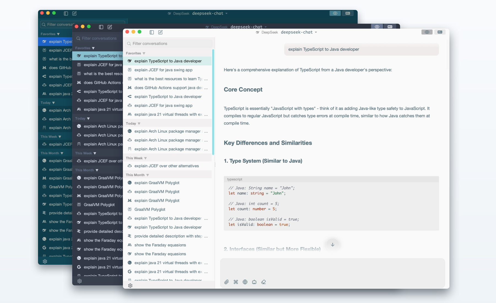

# Chat4J

[](https://github.com/drafael/chat4j/actions/workflows/ci.yml)
[](https://github.com/drafael/chat4j/actions/workflows/security.yml)
[](LICENSE)


Lightweight desktop AI chat client built with **Java 21**, **Swing**, and **Maven**.
Polished with [FlatLaf](https://github.com/JFormDesigner/FlatLaf) and bundled [IntelliJ themes](https://github.com/JFormDesigner/FlatLaf/tree/main/flatlaf-intellij-themes).
Chat transcripts can use native system WebViews via [SwingWebView](https://github.com/webliteca/swingwebview), Chromium through [jcefmaven](https://github.com/jcefmaven/jcefmaven) / [JCEF](https://github.com/chromiumembedded/java-cef), or a Swing fallback.

<p align="center">
  
</p>

## Quick start

```bash
mvn clean compile
mvn exec:java
```

## First run from release artifacts

Chat4J release artifacts are currently unsigned and not notarized. macOS Gatekeeper and Windows SmartScreen may warn or block the first launch. Only run artifacts you downloaded from the [official GitHub Releases page](https://github.com/drafael/chat4j/releases), and verify checksums before bypassing operating-system warnings.

Download `SHA256SUMS.txt` alongside the artifact you plan to run, then verify it from the download directory:

```bash
# macOS / Linux; replace the filename with the artifact you downloaded
artifact="Chat4J-<version>.dmg"
awk -v artifact="$artifact" '$2 == artifact { print }' SHA256SUMS.txt | shasum -a 256 -c -
```

```powershell
# Windows PowerShell; replace the filename with the artifact you downloaded
$artifact = "Chat4J-<version>.msi"
$parts = (Get-Content SHA256SUMS.txt | Where-Object { $_ -match "\s$([regex]::Escape($artifact))$" }) -split '\s+', 2
$actual = (Get-FileHash -Algorithm SHA256 $artifact).Hash.ToLowerInvariant()
if ($actual -ne $parts[0]) { throw "Checksum mismatch: $artifact" }
```

### macOS

If macOS says Chat4J “cannot be opened” or is from an unidentified developer:

1. Open **Finder** and locate `Chat4J.app`.
2. Control-click / right-click the app and choose **Open**.
3. Click **Open** again in the confirmation dialog.

If the app is still blocked, open **System Settings → Privacy & Security**, scroll to the Gatekeeper message for Chat4J, and click **Open Anyway**.

Advanced Terminal alternative:

```bash
xattr -dr com.apple.quarantine /Applications/Chat4J.app
open /Applications/Chat4J.app
```

Adjust the path if you installed Chat4J somewhere else.

### Windows

If Windows SmartScreen appears:

1. Click **More info**.
2. Click **Run anyway**.

If Windows marks the downloaded file as blocked:

1. Right-click the `.msi` or `.exe` and choose **Properties**.
2. On the **General** tab, check **Unblock** if present.
3. Click **Apply**, then run the installer again.

## Build & test

```bash
mvn clean package
mvn test
```

Run packaged jar:

```bash
java --enable-preview -jar target/chat4j-<version>.jar
```

## Dependency and security audits

```bash
# Generate JaCoCo coverage report and enforce core non-UI coverage gates
mvn -Pcoverage verify

# Generate CycloneDX SBOM files in target/bom.xml and target/bom.json
mvn -Psbom verify

# Run OWASP Dependency-Check; fails on CVSS 7+
mvn -Pdependency-audit verify

# Check available dependency/plugin updates
mvn versions:display-dependency-updates versions:display-plugin-updates
```

Dependabot is configured in `.github/dependabot.yml` for Maven and GitHub Actions updates. The scheduled Security Audit workflow runs OWASP Dependency-Check weekly and uploads HTML/JSON reports.

## What it does

- Desktop chat UI (Swing + FlatLaf)
- Multi-provider model selection
- Streaming assistant responses
- Local history/settings persistence (SQLite by default, optional H2, Flyway migrations)
- Agent Mode with local workspace tools

## Supported providers

### API-key providers (env vars)

- `ANTHROPIC_API_KEY`
- `GEMINI_API_KEY` (alias: `GOOGLEAI_API_KEY`)
- `OPENAI_API_KEY`
- `PERPLEXITY_API_KEY`
- `OPENROUTER_API_KEY`
- `GROQ_API_KEY`
- `DEEPSEEK_API_KEY`
- `MISTRAL_API_KEY`
- `XAI_API_KEY`

### Setting environment variables

Replace `sk-...` with your real API key. Restart Chat4J after changing environment variables.

#### macOS / Linux (bash or zsh)

For the current terminal session:

```bash
export OPENAI_API_KEY="sk-..."
mvn exec:java
```

To make it persistent, add the export line to your shell profile:

```bash
# zsh, default on modern macOS
echo 'export OPENAI_API_KEY="sk-..."' >> ~/.zshrc

# bash
echo 'export OPENAI_API_KEY="sk-..."' >> ~/.bashrc
```

Reload the profile or open a new terminal:

```bash
source ~/.zshrc   # or: source ~/.bashrc
```

On macOS, apps launched from Finder/Dock may not inherit terminal variables. Chat4J tries to load your login shell environment, but if keys are still missing, either launch Chat4J from Terminal or set the variable for GUI apps:

```bash
launchctl setenv OPENAI_API_KEY "sk-..."
```

#### Windows PowerShell

For the current PowerShell session:

```powershell
$env:OPENAI_API_KEY = "sk-..."
mvn exec:java
```

To make it persistent for your Windows user account:

```powershell
setx OPENAI_API_KEY "sk-..."
```

Close and reopen PowerShell, Command Prompt, or Chat4J after running `setx`.

#### Windows Command Prompt

For the current Command Prompt session:

```cmd
set OPENAI_API_KEY=sk-...
mvn exec:java
```

To make it persistent:

```cmd
setx OPENAI_API_KEY "sk-..."
```

### OAuth providers

- **OpenAI Codex**
- **GitHub Copilot**

### Local providers

- **LM Studio** — OpenAI-compatible server at `http://localhost:1234/v1` (no API key required)
- **Ollama** — OpenAI-compatible endpoint at `http://localhost:11434/v1` (no API key required)

## Documentation

- [docs/README.md](docs/README.md) — full documentation index

## Packaging

Native installers are built with `jpackage` via Maven profiles.
Each profile must run on the target OS (cross-packaging is not supported).

Use OS-specific profiles:

```bash
# macOS (.dmg)
mvn -Pjpackage-mac verify

# Windows (.msi) — requires WiX Toolset 3.x
mvn -Pjpackage-win verify

# Linux (.deb) — requires dpkg
mvn -Pjpackage-linux verify
```

Output artifacts are written to `target/dist/`.

## Release automation

GitHub Actions builds unsigned release artifacts for version tags and manual reruns:

```bash
git tag v26.6.13
git push origin v26.6.13
```

The release workflow publishes the shaded jar, macOS `.dmg`, Windows `.msi`, Linux `.deb`, SBOM files, and SHA-256 checksums.

## License

Apache License 2.0 — see [LICENSE](LICENSE).
