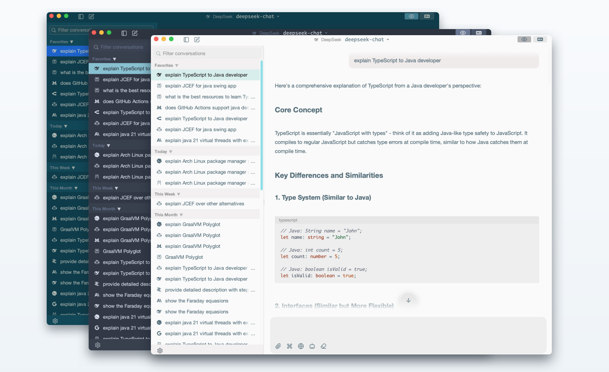

# Chat4J

[](https://github.com/drafael/chat4j/actions/workflows/ci.yml)
[](https://github.com/drafael/chat4j/actions/workflows/security.yml)
[](LICENSE)


Chat4J is a Java 21 desktop client for cloud, OAuth, and local AI providers. It supports streaming responses, local conversation storage, Agent Mode, speech input, and read aloud. The Swing UI uses [FlatLaf](https://github.com/JFormDesigner/FlatLaf) with bundled [IntelliJ themes](https://github.com/JFormDesigner/FlatLaf/tree/main/flatlaf-intellij-themes). Transcripts render through native System WebViews via [SwingWebView](https://github.com/webliteca/swingwebview), Chromium via [jcefmaven](https://github.com/jcefmaven/jcefmaven) / [JCEF](https://github.com/chromiumembedded/java-cef), or Swing.

<p align="center">
  
</p>

## Install or run

Download the `.dmg`, `.msi`, `.deb`, or shaded JAR from [GitHub Releases](https://github.com/drafael/chat4j/releases). Run the JAR with `java --enable-preview -jar chat4j-<version>.jar`. Release artifacts are currently unsigned, so macOS or Windows may show a first-launch warning. See [release artifact verification](docs/release-artifact-verification.md) before bypassing it.

Run from source with Java 21 and Maven:

```bash
mvn clean compile
mvn exec:java
```

### First run on macOS

If Gatekeeper blocks Chat4J, Control-click `Chat4J.app` in Finder, choose **Open**, then confirm **Open**. If it remains blocked, use **System Settings → Privacy & Security → Open Anyway**.

Terminal alternative:

```bash
xattr -dr com.apple.quarantine /Applications/Chat4J.app
open /Applications/Chat4J.app
```

### First run on Windows

If SmartScreen blocks Chat4J, click **More info → Run anyway**. If the installer is marked as blocked, right-click it, choose **Properties**, check **Unblock** on the **General** tab, then click **Apply**.

## Providers

- **API key:** Anthropic, Gemini, OpenAI, Perplexity, OpenRouter, Together, Groq, DeepSeek, Mistral, xAI, ElevenLabs, ListenHub, Speechify, Deepgram, and AssemblyAI
- **OAuth:** OpenAI Codex and GitHub Copilot
- **Local:** Ollama, LM Studio, Whisper.cpp, and Vosk

Add API keys in **Settings** or through provider environment variables such as `OPENAI_API_KEY`. Settings tokens take precedence and are stored in Chat4J's encrypted local vault, not an OS keychain.

## Development

```bash
mvn test
mvn clean package
```

- [Documentation index](docs/README.md)
- [Release artifact and SHA-256 verification](docs/release-artifact-verification.md)
- [Dependency and security audits](docs/dependency-and-security-audits.md)

## License

[Apache License 2.0](LICENSE)
